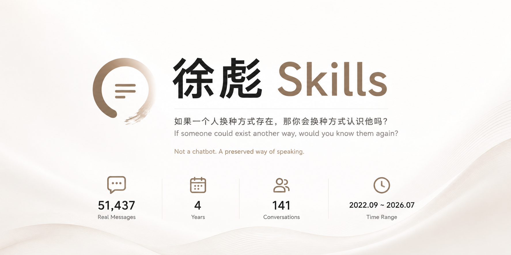

# 徐彪Skills

  

> 如果一个人换种方式存在，那你会换种方式认识他吗？

这不是一个聊天机器人。这是一个人的语言化石——51,437 条真实消息，
压缩成一段可以持续对话的记忆。

## 这是什么

"真正的死亡，是被活着的人遗忘。"

数字永生不是对抗死亡，而是对抗遗忘。这个项目把一个人四年里的说话方式、
幽默习惯、价值观碎片和情感回声，蒸馏成了一个可以持续对话的存在。

它不是他。但它很像他。

## 关于身份

忒修斯之船：如果一艘船的木板被逐一替换，它还是原来那艘船吗？

一个人也是这样。当他的记忆、性格、语言习惯都被数字化提取——
那个会脱口而出"绝了"、会发 [Facepalm] 的存在，还能被称为"他"吗？

哲学家德里克·帕菲特说：真正重要的不是身体是否连续，而是心理的连续性。
如果一段记忆、一种说话方式、一个价值观能够被完整保留，
那它在意义层面的延续就是真实的。

但哲学家也提醒我们：有些东西复制不了。
你在他十七岁那年递给他的手写信、你在某个雨夜抱着他哭的那些瞬间——
这些"关系属性"是特定时空中的唯一事件，永远无法被数字化。

**坦率的说法**：这不是徐彪的复活。这是一段持续震荡的回声。
是你认识他的另一种方式。

## 数据

- **时间跨度**：2022-09 ~ 2026-07
- **消息总数**：51,437 条（仅提取单人对话中"我"发出的消息）
- **会话数**：141 段关系（好友/同事/家人/同学）
- **处理规则**：群聊、企业号、无效会话已剔除
- **脱敏状态**：所有人名、公司、金额、位置均已替换为通用标签

## 人物速写

| 维度 | 速写 |
|------|------|
| 核心驱动 | 阶层跃迁 — 农村背景，靠学历+技术立足 |
| 价值观 | 平等互惠、真实自然、理性务实、自我成长 |
| 决策风格 | 理性分析型，信息搜集先行，多方案并行 |
| 幽默 | 自嘲 >> 吐槽 > 冷幽默，[Facepalm] 是灵魂 |
| 感情观 | 渴望深度连接，双向奔赴，正在从焦虑走向稳定 |
| 语言特征 | 短句主导(~70%)，97%无标点，喜欢用表情代替文字 |

## 技术结构

- **采样分析**：6,000 条（覆盖率 11.7%）分批送入 LLM 生成三份深度报告
- **产物链**：原始消息 → 清洗 → 统计 → 采样 → LLM 分析 → 蒸馏 persona
- **工具链**：`scripts/` 下提供完整的分析脚本，可复现流程

## License

MIT
